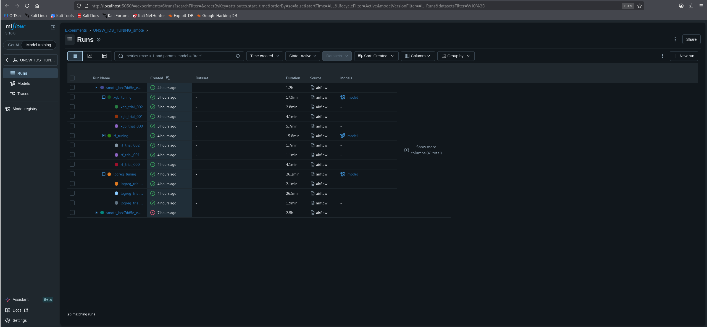
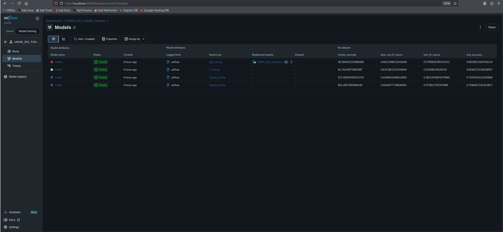
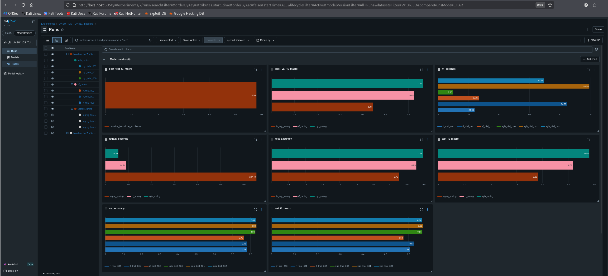
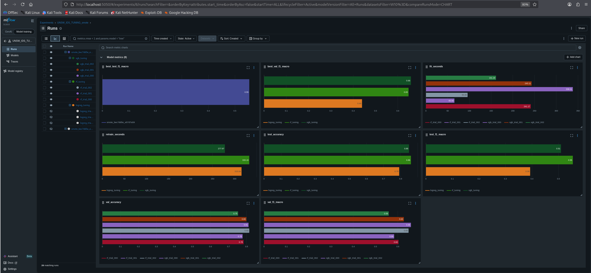
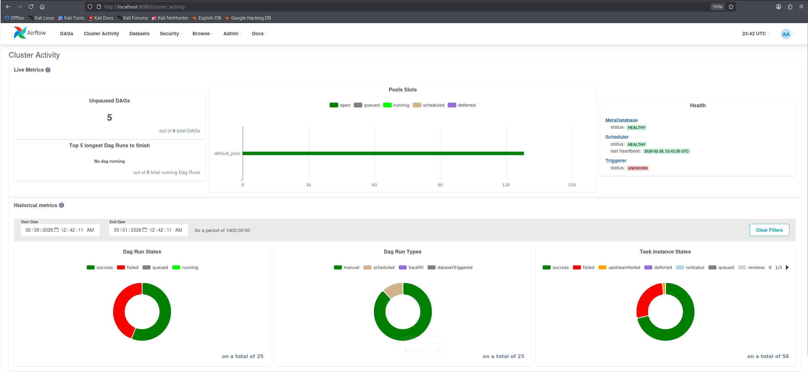

# 🤖 MLOps Example (Airflow + MLflow + S3 + Jupyter + Docker)
Это репозиторий показывает, как организовать тренировочные DAG'и, трекинг экспериментов и простую интеграцию с S3-хранилищем через удобную инфраструктурную конфигурацию с использованием `docker-compose`.

## 🛠 Технологический стек
- **Airflow** - управление и оркестрация задач (S3Hook, AWSConnection, Variables).
- **MLflow** - трекинг экспериментов и реестр моделей.
- **S3-хранилище (SberCloud)** - работа с данными, их хранение.
- **Docker Compose** - быстрый способ поднять стек локально.
- **Jupyter** - работа с Python.

## 🗂️ Структура репозитория
- `docker-compose.yml`: конфигурация сервисов.
- `.env`: хранилище секретов и переменных.
- `dags/`: DAG'и (`example.py`, `test.py`, `example_2.py`).
- `plugins/`: плагины Airflow.
- `scripts/`: вспомогательные скрипты для создания connection и variables в Airflow.
- `config/`: конфигурационные файлы и шаблоны.
- `jupyter-data/`: ноутбуки и данные для экспериментов.
- `logs/`: логи запуска DAG'ов.

## 🔑 Создание своего .env
В `.env.example` представлен минимальный пример .env файла.

## 🚀 Быстрый старт
1. Загрузите репозиторий:
```bash
git clone https://github.com/hokinhim/MLOps.git
```

2. Перейдите в созданную директорию:
```bash
cd MLOps
```

3. Выдайте необходимые права:
```bash
chmod -R 777 dags/
chmod -R 777 logs/
chmod -R 777 scripts/
```

3. Проверьте локальную среду на наличие Docker и Docker Compose:

```bash
docker --version
docker-compose --version
```

4. Настройте свой `.env`.

5. Запустите контейнеры:
```bash
docker-compose up -d
```

6. Перейдите на веб-интерфейсы:
- Airflow: http://localhost:8080
- MLflow: http://localhost:5050
- Jupyter: http://localhost:8888

## ⚙️ Использование
В Airflow включите нужный DAG и запустите вручную или дождитесь расписания.
MLflow используется для логирования параметров, метрик и артефактов из задач внутри DAG'ов.

## ✨ Полезные скрипты
В директории `scripts/` есть следующие скрипты:
- `create_s3_conn.py` - пример создания AWS-подключения в Airflow.
- `create_var.py` - пример создания переменных в Airflow.

Использование:
```bash
docker compose exec airflow-webserver python /opt/airflow/scripts/create_s3_conn.py
docker compose exec airflow-webserver python /opt/airflow/scripts/create_var.py
```

## 🎨 Скриншоты интерфейсов
### Обзор эксперимента:

### Обзор моделей:

### Обзор эксперимента baseline:

### Обзор эксперимента SMOTE:

### Обзор DaG'ов:


## 📄 Лицензия
Проект распространяется под лицензией MIT ([LICENSE](LICENSE)).